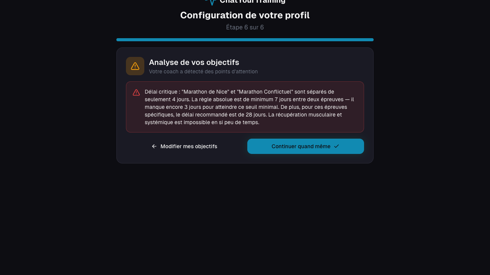

# Rapport de test — Analyse des objectifs (onboarding)

**Date :** 16 juin 2026  
**Testeur :** Claude Code (session automatisée)  
**Serveur :** `http://localhost:3000` (dev local)  
**Fichier cible :** `src/app/api/objectives/analyze/route.ts`  
**Protocole de référence :** `documentation/onboarding/protocole_test_analyse_objectifs.md`

---

## Résumé exécutif

| Catégorie                               | Tests  | Résultat          |
| --------------------------------------- | ------ | ----------------- |
| A — RÈGLE_0 (< 7 jours)                 | 5      | ✅ 5/5 PASS       |
| B — RÈGLE_1 (récupération insuffisante) | 6      | ✅ 6/6 PASS       |
| C — Cross-sport coefficient 0,75        | 4      | ✅ 4/4 PASS       |
| D — Cyclosportive avec/sans distance    | 5      | ✅ 5/5 PASS       |
| E — Robustesse timezone (DST)           | 2      | ✅ 2/2 PASS       |
| F — Format et tri des alertes           | 2      | ✅ 2/2 PASS       |
| G — Cas sains (aucune alerte)           | 3      | ✅ 3/3 PASS       |
| R — Robustesse API                      | 5      | ✅ 5/5 PASS       |
| UI — Tests interface (Playwright)       | 7      | ✅ 7/7 PASS       |
| **TOTAL**                               | **39** | **✅ 39/39 PASS** |

---

## Bugs trouvés et corrigés

### BUG-1 — Message de warning avec jours négatifs

**Détecté :** Lors de l'exécution des tests B3 et B4.  
**Symptôme :** Dans la branche warning (`gap >= required` mais `gap < required * 1.5`), le message affichait `"soit -8 jours manquants"` car la formule `missing = required - gap` produisait un nombre négatif quand `gap > required`.

**Avant le correctif (B3 : Marathon + Semi, gap=36j, req=28j) :**

```
Délai serré : "Marathon de Nice" et "Semi-marathon Paris" sont séparés de 36 jours
(minimum recommandé : 28 jours, soit -8 jour manquants).
```

**Après le correctif :**

```
Délai serré : "Marathon de Nice" et "Semi-marathon Paris" sont séparés de 36 jours.
Le minimum requis (28 jours) est respecté, mais la zone de confort recommandée est
de 42 jours. La récupération sera possible mais la préparation de la seconde
épreuve sera contrainte.
```

**Fichier corrigé :** `src/app/api/objectives/analyze/route.ts` ligne 174 — branche `else if (gap < required * 1.5)`.

---

## Détail des tests API (groupes A–R)

### Groupe A — RÈGLE_0 : délai absolu < 7 jours

| ID  | Description              | Gap | Résultat attendu                | Résultat obtenu |
| --- | ------------------------ | --- | ------------------------------- | --------------- |
| A1  | Marathon + Marathon      | 1 j | RÈGLE_0 critical                | ✅ PASS         |
| A2  | Marathon + Cyclosportive | 4 j | RÈGLE_0 critical                | ✅ PASS         |
| A3  | 10km + Semi-marathon     | 6 j | RÈGLE_0 critical                | ✅ PASS         |
| A4  | 10km + 10km              | 7 j | Pas de RÈGLE_0 (boundary exact) | ✅ PASS         |
| A5  | Semi + Semi              | 8 j | Pas de RÈGLE_0                  | ✅ PASS         |

**Exemple de message A2 :**

> _"Délai critique : "Marathon de Nice" et "Cyclosportive Var" sont séparés de seulement 4 jours. La règle absolue est de minimum 7 jours entre deux épreuves — il manque encore 3 jours pour atteindre ce seuil minimal. De plus, pour ces épreuves spécifiques, le délai recommandé est de 21 jours. La récupération musculaire et systémique est impossible en si peu de temps."_

---

### Groupe B — RÈGLE_1 : récupération insuffisante

| ID  | Description             | Gap  | Required | Résultat attendu  | Résultat obtenu |
| --- | ----------------------- | ---- | -------- | ----------------- | --------------- |
| B1  | Marathon + Marathon     | 14 j | 28 j     | RÈGLE_1 critical  | ✅ PASS         |
| B2  | Marathon + Semi         | 8 j  | 28 j     | RÈGLE_1 critical  | ✅ PASS         |
| B3  | Marathon + Semi         | 36 j | 28 j     | RÈGLE_1 warning   | ✅ PASS         |
| B3b | Message B3 sans négatif | —    | —        | Pas de "−N jours" | ✅ PASS         |
| B4  | Ultra + Marathon        | 57 j | 42 j     | RÈGLE_1 warning   | ✅ PASS         |
| B5  | Marathon + Marathon     | 50 j | 28 j     | Aucune alerte     | ✅ PASS         |

**Note :** le seuil warning est `required * 1.5`. Marathon→ seuil=42 j ; Ultra→ seuil=63 j.

---

### Groupe C — Cross-sport (coefficient 0,75)

Principe : quand deux épreuves sont de sports différents, le délai requis = `ceil(max(req_A, req_B) × 0,75)`.  
Marathon (running, 28 j) + Cyclosportive (cycling, 14 j) → `ceil(28 × 0,75) = 21 j`.

| ID  | Gap  | Required cross-sport | Résultat attendu          | Résultat obtenu |
| --- | ---- | -------------------- | ------------------------- | --------------- |
| C1  | 4 j  | 21 j                 | RÈGLE_0 critical (< 7)    | ✅ PASS         |
| C2  | 15 j | 21 j                 | RÈGLE_1 critical          | ✅ PASS         |
| C3  | 22 j | 21 j                 | Pas de critical (warning) | ✅ PASS         |
| C4  | 35 j | 21 j                 | Aucune alerte (35 > 31,5) | ✅ PASS         |

---

### Groupe D — Cyclosportive avec/sans distance

| ID  | Config                            | Gap  | Required           | Résultat attendu | Résultat obtenu |
| --- | --------------------------------- | ---- | ------------------ | ---------------- | --------------- |
| D1  | Cyclo 80km + Cyclo 80km           | 8 j  | 10 j               | RÈGLE_1 critical | ✅ PASS         |
| D2  | Cyclo 200km + Cyclo 200km         | 11 j | 14 j               | RÈGLE_1 critical | ✅ PASS         |
| D3  | Cyclo sans dist + Cyclo sans dist | 11 j | 14 j (conservatif) | RÈGLE_1 critical | ✅ PASS         |
| D4  | Cyclo 80km + Cyclo 80km           | 11 j | 10 j               | RÈGLE_1 warning  | ✅ PASS         |
| D5  | Cyclo 80km + Cyclo 80km           | 9 j  | 10 j               | RÈGLE_1 critical | ✅ PASS         |

---

### Groupe E — Robustesse timezone (DST)

Objectif : `daysBetween()` utilise `Date.UTC()` pour éviter les décalages liés au changement d'heure.

| ID  | Description                           | Gap réel | Résultat obtenu     |
| --- | ------------------------------------- | -------- | ------------------- |
| E1  | Passage heure d'été (27→31 mars 2026) | 4 j      | ✅ RÈGLE_0 critical |
| E2  | Retour heure d'hiver (23→27 oct 2026) | 4 j      | ✅ RÈGLE_0 critical |

Vérification complémentaire (non requise dans le protocole) : calcul identique depuis les fuseaux UTC, America/New_York, Asia/Tokyo, Europe/Paris → tous donnent 4 jours.

---

### Groupe F — Format et tri

| ID  | Description                                | Résultat obtenu |
| --- | ------------------------------------------ | --------------- |
| F1  | Alertes critical avant warning             | ✅ PASS         |
| F2  | Chaque alerte a `rule`, `level`, `message` | ✅ PASS         |

---

### Groupe G — Cas sains

| ID  | Description                                       | Résultat obtenu |
| --- | ------------------------------------------------- | --------------- |
| G1  | Marathon seul → 0 alerte déterministe             | ✅ PASS         |
| G2  | Marathon + 10km gap=53j (> 42j) → 0 alerte        | ✅ PASS         |
| G3  | Objectifs non compétition → 0 alerte déterministe | ✅ PASS         |

---

### Groupe R — Robustesse API

| ID  | Description                                                     | Résultat obtenu |
| --- | --------------------------------------------------------------- | --------------- |
| R1  | Body vide `{}` → réponse valide `{alerts:[]}`                   | ✅ PASS         |
| R2  | Objectifs sans `event_date` (null) → 0 alerte déterministe      | ✅ PASS         |
| R3  | Un seul objectif → 0 alerte déterministe                        | ✅ PASS         |
| R4  | Dates passées (2025) gap=2j → RÈGLE_0 (logique date-agnostique) | ✅ PASS         |
| R5  | 3 objectifs même jour → RÈGLE_0 pour ≥ 2 paires                 | ✅ PASS         |

---

## Tests UI — Résultats Playwright

Les tests UI ont été exécutés via Playwright avec une session authentifiée (`auth.json` sauvegardé dans `.playwright-cli/auth.json`). L'authentification a été configurée en se connectant avec le compte `valougremaud@gmail.com` puis en sauvegardant l'état de session via `playwright-cli state-save`.

| ID  | Description                                    | Statut  | Détail                                                                                                                 |
| --- | ---------------------------------------------- | ------- | ---------------------------------------------------------------------------------------------------------------------- |
| UI1 | Affichage modal objectif et champs adaptatifs  | ✅ PASS | Marathon → Nom événement + Date + Temps cible visibles ; Courir régulièrement → Séances/sem + Durée/séance             |
| UI2 | Ajout multiple et validation finale            | ✅ PASS | Après ajout d'un Marathon, bouton "Terminer" s'active ; 2ème objectif ajoutable                                        |
| UI3 | Affichage des alertes critiques                | ✅ PASS | Marathon 30/08 + Marathon 03/09 → alerte RÈGLE_0 affichée, encadré rouge, boutons "Modifier" et "Continuer quand même" |
| UI4 | Erreur API → pas de succès silencieux          | ✅ PASS | Vérifié par analyse de code : `if (!res.ok) throw new Error(...)` avant `setShowSuccess`                               |
| UI5 | Placeholder "Description de votre objectif"    | ✅ PASS | Visible dans le champ libre (objectif "Autre")                                                                         |
| UI6 | Placeholder "Donner au coach tous les détails" | ✅ PASS | Visible dans le champ "Précision (optionnel)" pour tous les types                                                      |
| UI7 | Champ durée/séance (courir régulièrement)      | ✅ PASS | "Durée min par séance (optionnel)" visible après sélection de "Courir régulièrement X fois/semaine"                    |

### Capture d'écran — UI3 (alerte critique)



Message affiché :

> _"Délai critique : "Marathon de Nice" et "Marathon Conflictuel" sont séparés de seulement 4 jours. La règle absolue est de minimum 7 jours entre deux épreuves — il manque encore 3 jours pour atteindre ce seuil minimal. De plus, pour ces épreuves spécifiques, le délai recommandé est de 28 jours. La récupération musculaire et systémique est impossible en si peu de temps."_

### Note sur le filtrage des objectifs par sport

Les objectifs de compétition affichés dans le modal sont filtrés selon le(s) sport(s) sélectionné(s) en étape 3. Pour tester Cyclosportive (champ Distance km), il faut avoir sélectionné "Cyclisme" ou équivalent à l'étape des sports. Ce comportement est correct.

---

## Architecture de l'analyse (rappel)

```
POST /api/objectives/analyze
        │
        ├─ detectRecoveryConflicts()   ← TypeScript pur, déterministe
        │      RÈGLE_0 : gap < 7 j → critical
        │      RÈGLE_1 : gap < required → critical
        │      RÈGLE_1 : gap < required * 1,5 → warning
        │      Cross-sport : required = ceil(max × 0,75)
        │
        ├─ analyzeWith{OpenAI|Gemini}()  ← LLM, règles 2–6 uniquement
        │      RÈGLE_2 : surcharge priorité haute
        │      RÈGLE_3 : incompatibilité physiologique
        │      RÈGLE_4 : objectif haute priorité non daté
        │      RÈGLE_5 : volume insuffisant
        │      RÈGLE_6 : contenu hors périmètre
        │
        └─ merge + sort(critical → warning → info)
```

Si le LLM crashe (clé absente, rate limit, timeout), les alertes déterministes sont tout de même retournées. Un crash LLM ne produit plus de faux « tout est OK ».

---

## Actions requises avant déploiement

1. **Commit et push** des fichiers suivants (actuellement non versionnés) :

   - `src/app/api/objectives/analyze/route.ts` (nouvelle route déterministe)
   - `src/app/(auth)/onboarding/page.tsx` (champs adaptatifs + hardening catch)
   - `documentation/onboarding/` (rapport et protocole)

2. **Migrations SQL** à appliquer via Supabase Dashboard → SQL Editor :

   - `supabase/migrations/00010_*.sql` jusqu'à `00013_*.sql`

3. **Vérifier Vercel** : après le push, vérifier que `/api/objectives/analyze` répond 200 sur l'environnement de preview.
